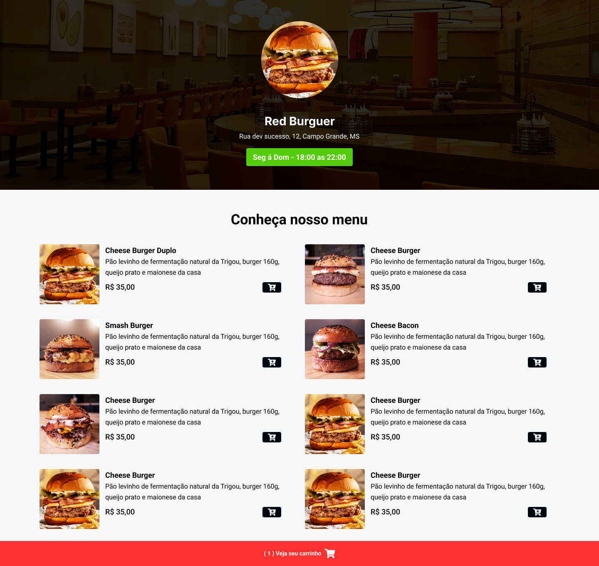
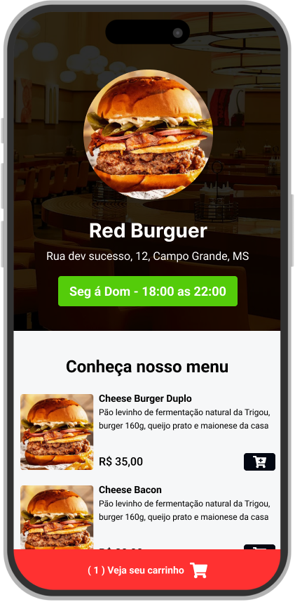
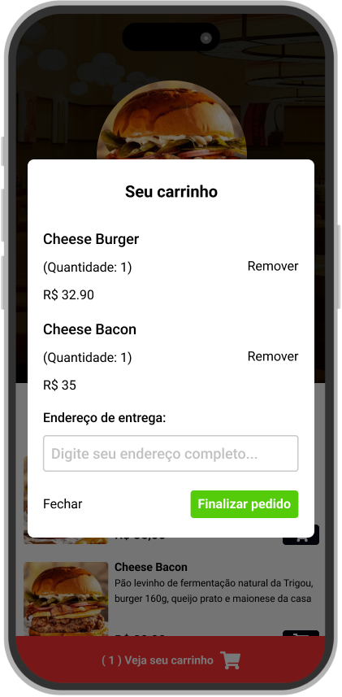

<h1 text-align="center">Cardapio</h1>

  🌎 Result Preview: [Veja o Projeto](https://cardapio-finalizado.vercel.app/)

---

Imagens do Projeto
   
   
   
   
  
  

---
## 💻 Projeto - Cardapio com JS

Projeto realizado com o Youtuber Sujeiro Programador com finalidades de testar os conhecimento nas linguagens HTML ,CSS, JS e TAILWIND.

## 🧪 Tecnologias | 

---
- Mobile First
- Unidade de medida flexível
- Variáveis
- Grid
- Animações e transições
- Media queries.
- Funções
- Callbacks
- Eventos

### Informações  

🕛 **Status:** Concluído✔️

☑️ **Task:** Construir um site estático a partir do projeto feito no [Figma](https://www.figma.com).
- [Design Figma](https://www.figma.com/file/oa2OsSzV6tvNkWMyDBU3jT/Restaurant---Sujeito-Programador-(Community)?type=design&node-id=0-1&mode=design&t=pVukStByJiXCaC5c-0)

Developed by Jeferson 🚀

